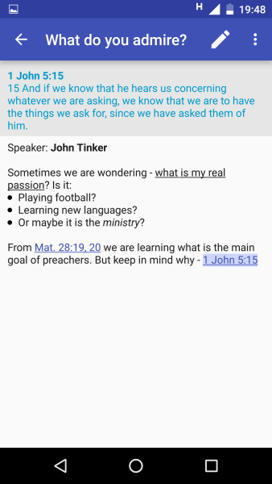
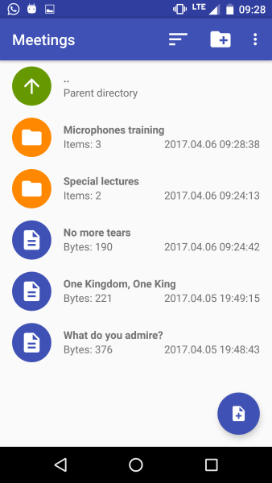
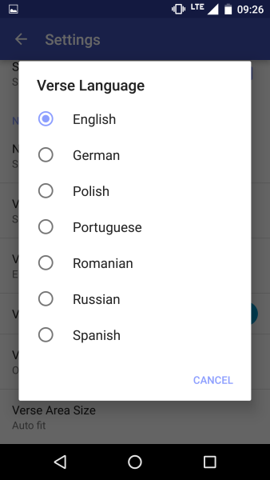

Notepad JT
===

Notes manager and editor with live view of entered verses for Android.

App is available on Play Store:

Click picture below to start a presentation.

## Screenshots

## License

    Copyright 2017-2025 Jakub Tomala

    Licensed under the Apache License, Version 2.0 (the "License");
    you may not use this file except in compliance with the License.
    You may obtain a copy of the License at

        http://www.apache.org/licenses/LICENSE-2.0

    Unless required by applicable law or agreed to in writing, software
    distributed under the License is distributed on an "AS IS" BASIS,
    WITHOUT WARRANTIES OR CONDITIONS OF ANY KIND, either express or implied.
    See the License for the specific language governing permissions and
    limitations under the License.
